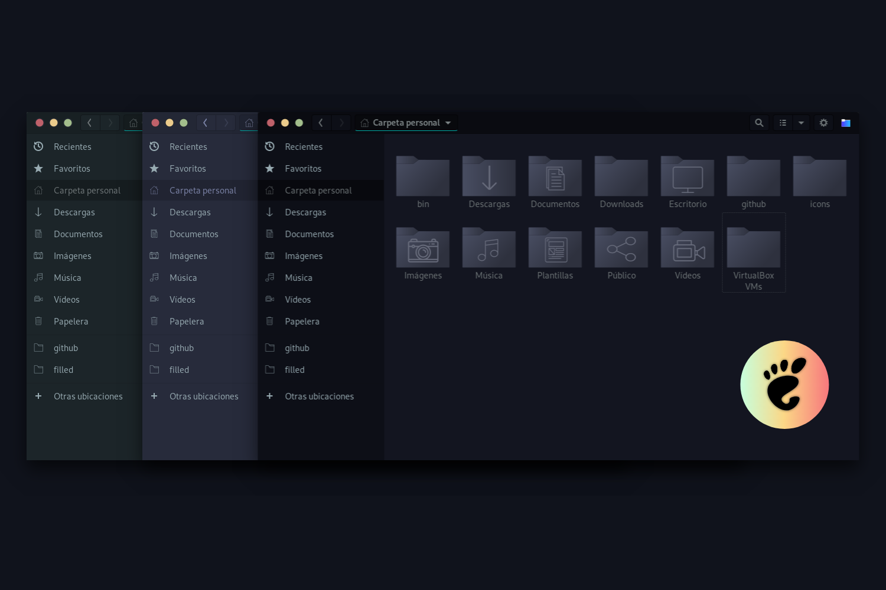

#### Installation

Extract the zip file to the themes directory i.e. `/usr/share/themes/` or `~/.themes/` (create it if necessary).

To set the theme on Gnome, run the following commands in Terminal:

```sh
gsettings set org.gnome.desktop.interface gtk-theme "Juno"
gsettings set org.gnome.desktop.wm.preferences theme "Juno"
```

or for Juno v40 run:

```sh
gsettings set org.gnome.desktop.interface gtk-theme "Juno-v40"
gsettings set org.gnome.desktop.wm.preferences theme "Juno-v40"
```

or Change via distribution specific tool.


